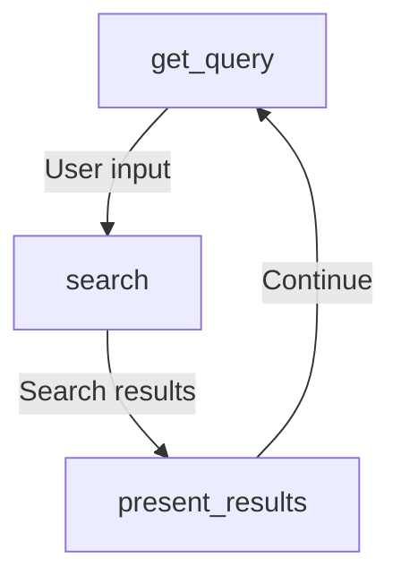
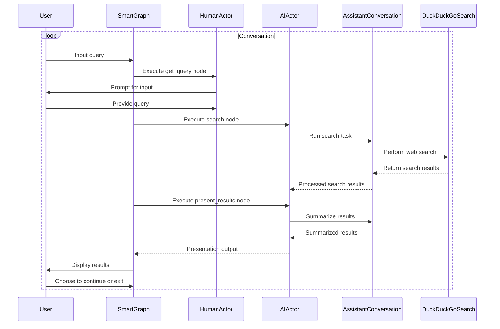
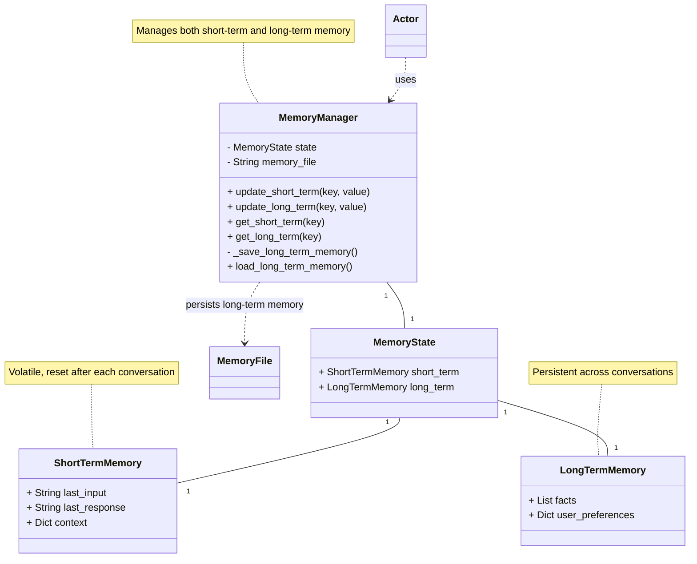
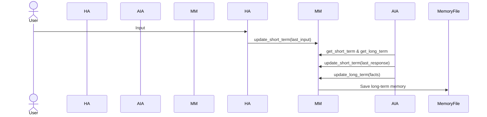
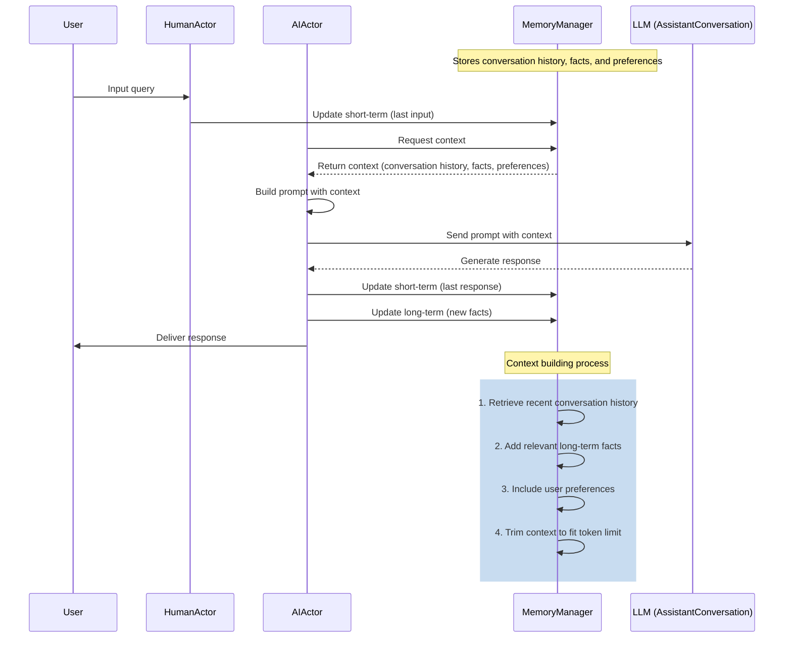

The search_assistant is a conversational AI system that performs web searches based on user queries. Here's an overview of its operation:

1. Setup:

   - Initializes API keys, model, and logging.
   - Creates a DuckDuckGoSearch tool for web searches.
   - Sets up an AssistantConversation with search capabilities.
   - Constructs a SmartGraph with HumanActor and AIActor.

2. Graph Structure:
   The SmartGraph consists of three main nodes:



3. Execution Flow:
   The main execution loop in `run_search_assistant()` function:



Key Components and Their Roles:

1. SmartGraph: Manages the overall flow of the conversation and execution of nodes.

2. HumanActor: Handles user input in the get_query node.

3. AIActor: Performs AI-related tasks in the search and present_results nodes.

4. AssistantConversation: Manages the conversation with the AI model, including processing queries and formatting responses.

5. DuckDuckGoSearch: Performs actual web searches based on user queries.

6. MemoryManager: Maintains short-term and long-term memory for the conversation.

7. CheckpointManager: Saves and loads the state of the conversation, allowing for persistence across sessions.

The system operates in a loop, moving through the nodes of the graph:

1. get_query: Prompts the user for input.
2. search: Processes the query, performs a web search, and analyzes the results.
3. present_results: Summarizes and presents the search results to the user.

After each cycle, the user is asked if they want to continue. The conversation state is periodically saved as checkpoints, allowing for recovery or continuation of sessions.

This implementation allows for a flexible, stateful conversation flow with web search capabilities, combining the strengths of large language models with real-time internet data.

Certainly! Let's take a closer look at the MemoryManager and how it handles the state of the conversation and long-term memory. I'll use a Mermaid diagram to illustrate the structure and flow of information.

First, let's review the key components of the MemoryManager:

1. Short-term memory: Stores recent inputs, responses, and context.
2. Long-term memory: Stores facts and user preferences.
3. Methods for updating and retrieving information from both short-term and long-term memory.
4. Persistence of long-term memory to a file.

Now, let's visualize this with a Mermaid diagram:





This diagram illustrates the structure of the MemoryManager and how it interacts with the conversation flow. Here's a breakdown of the key points:

1. Structure:

   - MemoryManager contains a MemoryState, which in turn contains ShortTermMemory and LongTermMemory.
   - ShortTermMemory stores the last input, last response, and current context.
   - LongTermMemory stores facts and user preferences.

2. Data Flow:

   - User input is processed by the HumanActor and stored in short-term memory.
   - AIActor retrieves both short-term and long-term memory to generate responses.
   - AIActor updates short-term memory with its response and may update long-term memory with new facts.
   - Long-term memory is periodically saved to a file (memory.md) for persistence.

3. Memory Characteristics:

   - Short-term memory is volatile and typically reset after each conversation.
   - Long-term memory persists across conversations, allowing for accumulated knowledge and user preferences.

4. Interaction with Actors:

   - Both HumanActor and AIActor interact with the MemoryManager to read and write memory states.
   - This interaction allows for maintaining context within a conversation and across multiple conversations.

5. Persistence:
   - The `_save_long_term_memory()` method saves long-term memory to a file, ensuring persistence.
   - The `load_long_term_memory()` method loads previously saved long-term memory at the start of a new session.

This design allows for flexible handling of conversation state:

- Short-term memory provides immediate context within a single conversation.
- Long-term memory allows the system to remember important facts and user preferences across multiple conversations.
- The separation of short-term and long-term memory allows for easy management of what information should be persistent vs. transient.

By making the MemoryManager optional in the Actors, as we did in the previous update, we allow for both stateful conversations (using the full capabilities of the MemoryManager) and stateless conversations (bypassing the MemoryManager entirely) within the same system.


You're right to bring up the context for conversations with LLMs. This is an important aspect that we should incorporate into our MemoryManager and conversation flow. Let's explore how we can enhance our system to better handle context for LLM conversations.




Now, let's discuss how we can enhance our MemoryManager to better handle context for LLM conversations:

1. Conversation History:
   - Keep a list of recent messages (both user inputs and AI responses) in the short-term memory.
   - Implement a method to retrieve the recent conversation history.

2. Context Building:
   - Create a new method in MemoryManager called `build_llm_context()` that combines:
     a. Recent conversation history
     b. Relevant long-term facts
     c. User preferences
   - This method should also handle trimming the context to fit within the LLM's token limit.

3. Relevance Scoring:
   - Implement a simple relevance scoring system for long-term facts.
   - When building context, include only the most relevant facts based on the current conversation.

4. Dynamic Context Management:
   - Adjust the amount of context provided based on the complexity of the conversation.
   - For simple queries, less context might be needed, while for more complex conversations, more context could be beneficial.

Here's a pseudo-code example of how we might implement these enhancements in our MemoryManager:


```python
import asyncio
from typing import List, Dict, Any

class MemoryManager:
    # ... existing code ...

    async def build_llm_context(self, current_query: str, max_tokens: int = 2000) -> str:
        context_parts = []

        # 1. Add recent conversation history
        history = await self.get_short_term("conversation_history")
        context_parts.append("Recent conversation:")
        context_parts.extend(history[-5:])  # Last 5 exchanges

        # 2. Add relevant long-term facts
        facts = await self.get_long_term("facts")
        relevant_facts = self._get_relevant_facts(current_query, facts)
        if relevant_facts:
            context_parts.append("Relevant information:")
            context_parts.extend(relevant_facts)

        # 3. Add user preferences
        preferences = await self.get_long_term("user_preferences")
        if preferences:
            context_parts.append("User preferences:")
            context_parts.extend([f"{k}: {v}" for k, v in preferences.items()])

        # 4. Trim context to fit token limit
        context = "\n".join(context_parts)
        return self._trim_to_token_limit(context, max_tokens)

    def _get_relevant_facts(self, query: str, facts: List[str]) -> List[str]:
        # Simple relevance scoring based on word overlap
        query_words = set(query.lower().split())
        return [fact for fact in facts if len(set(fact.lower().split()) & query_words) > 0]

    def _trim_to_token_limit(self, text: str, max_tokens: int) -> str:
        # Simple trimming strategy: keep as many full sentences as possible
        tokens = text.split()
        if len(tokens) <= max_tokens:
            return text

        trimmed_tokens = tokens[:max_tokens]
        last_period = ' '.join(trimmed_tokens).rfind('.')
        return ' '.join(trimmed_tokens[:last_period + 1])

    async def update_conversation_history(self, message: str, is_user: bool = True):
        history = await self.get_short_term("conversation_history")
        prefix = "User: " if is_user else "AI: "
        history.append(f"{prefix}{message}")
        await self.update_short_term("conversation_history", history[-10:])  # Keep last 10 messages

```

With these enhancements:

1. The `build_llm_context()` method creates a rich context for each LLM interaction, combining recent history, relevant facts, and user preferences.

2. The `_get_relevant_facts()` method implements a simple relevance scoring system based on word overlap. This could be enhanced with more sophisticated NLP techniques in the future.

3. The `_trim_to_token_limit()` method ensures that the context fits within the LLM's token limit while trying to maintain coherent sentences.

4. The `update_conversation_history()` method keeps track of the ongoing conversation, which is used in building the context.

To integrate this into our existing system:

1. Update the AIActor to use this new context-building method before interacting with the LLM.
2. Modify the conversation flow to update the conversation history after each exchange.
3. Adjust the LLM prompts to effectively use this richer context.

By implementing these changes, we create a more context-aware system that can provide the LLM with relevant information from both short-term and long-term memory. This should result in more coherent and contextually appropriate responses from the AI, enhancing the overall quality of the conversation.