The search_assistant is a conversational AI system that performs web searches based on user queries. Here's an overview of its operation:

1. Setup:

   - Initializes API keys, model, and logging.
   - Creates a DuckDuckGoSearch tool for web searches.
   - Sets up an AssistantConversation with search capabilities.
   - Constructs a SmartGraph with HumanActor and AIActor.

2. Graph Structure:
   The SmartGraph consists of three main nodes:

3. Execution Flow:
   The main execution loop in `run_search_assistant()` function:

```mermaid
sequenceDiagram
    participant User
    participant SmartGraph
    participant HumanActor
    participant AIActor
    participant AssistantConversation
    participant DuckDuckGoSearch

    loop Conversation
        User->>SmartGraph: Input query
        SmartGraph->>HumanActor: Execute get_query node
        HumanActor->>User: Prompt for input
        User->>HumanActor: Provide query
        SmartGraph->>AIActor: Execute search node
        AIActor->>AssistantConversation: Run search task
        AssistantConversation->>DuckDuckGoSearch: Perform web search
        DuckDuckGoSearch-->>AssistantConversation: Return search results
        AssistantConversation-->>AIActor: Processed search results
        SmartGraph->>AIActor: Execute present_results node
        AIActor->>AssistantConversation: Summarize results
        AssistantConversation-->>AIActor: Summarized results
        AIActor-->>SmartGraph: Presentation output
        SmartGraph->>User: Display results
        User->>SmartGraph: Choose to continue or exit
    end

```

Key Components and Their Roles:

1. SmartGraph: Manages the overall flow of the conversation and execution of nodes.

2. HumanActor: Handles user input in the get_query node.

3. AIActor: Performs AI-related tasks in the search and present_results nodes.

4. AssistantConversation: Manages the conversation with the AI model, including processing queries and formatting responses.

5. DuckDuckGoSearch: Performs actual web searches based on user queries.

6. MemoryManager: Maintains short-term and long-term memory for the conversation.

7. CheckpointManager: Saves and loads the state of the conversation, allowing for persistence across sessions.

The system operates in a loop, moving through the nodes of the graph:

1. get_query: Prompts the user for input.
2. search: Processes the query, performs a web search, and analyzes the results.
3. present_results: Summarizes and presents the search results to the user.

After each cycle, the user is asked if they want to continue. The conversation state is periodically saved as checkpoints, allowing for recovery or continuation of sessions.

This implementation allows for a flexible, stateful conversation flow with web search capabilities, combining the strengths of large language models with real-time internet data.

Certainly! Let's take a closer look at the MemoryManager and how it handles the state of the conversation. The MemoryManager is responsible for maintaining both short-term and long-term memory for the conversation.

Here's a breakdown of the MemoryManager's structure and functionality:

The state in the MemoryManager consists of two main components:

1. Short-Term Memory (ShortTermMemory):

   - last_input: Stores the most recent user input.
   - last_response: Stores the most recent AI response.
   - context: A dictionary for storing temporary, context-specific information.

2. Long-Term Memory (LongTermMemory):
   - conversation_history: A deque (double-ended queue) that stores the entire conversation history, limited to a maximum number of entries (MAX_CONVERSATION_HISTORY).
   - max_response_length: Tracks the maximum length of AI responses.
   - user_preferences: Stores user-specific preferences or settings.
   - last_accessed: Keeps track of when each piece of long-term memory was last accessed.

The MemoryManager provides methods to update and retrieve both short-term and long-term memory:

1. update_short_term(key: str, value: Any):

   - Updates a specific key in the short-term memory.
   - This could be used to update the last input, last response, or add context.

2. update_long_term(key: str, value: Any):

   - Updates a specific key in the long-term memory.
   - If the key is "conversation_history", it appends the value to the conversation history deque.
   - For other keys, it updates the corresponding value in long-term memory.

3. get_short_term(key: str) and get_long_term(key: str):

   - Retrieve values from short-term and long-term memory, respectively.

4. cleanup_long_term_memory():
   - Removes long-term memory items that haven't been accessed for a certain period (LONG_TERM_MEMORY_TTL).

The state is maintained throughout the conversation and is used to provide context for the AI's responses. Here's how it's typically used in the search assistant:

1. When a user inputs a query, it's stored in short-term memory (last_input).
2. The AI's response is stored in short-term memory (last_response) and added to the conversation history in long-term memory.
3. Any relevant context from the search results or AI processing can be stored in the context dictionary of short-term memory.
4. User preferences or persistent information can be stored in long-term memory.

This state management allows the search assistant to maintain context across multiple turns of conversation, remember user preferences, and provide more coherent and contextually relevant responses. The separation of short-term and long-term memory allows for efficient access to recent information while also maintaining a persistent conversation history.
